# 🤝 Humanity Protocol x NanoCredit

## Grant Proposal & Partnership Document

**Prepared for:** Humanity Protocol Team  
**Prepared by:** Alexander Schmitt & Tanya Montmean, NanoCredit  
**Date:** November 2025  
**Requested Funding:** \$50,000 (Development Phase - Milestone-based)

---

## 📋 Executive Summary

**Mission Alignment**: Provide uncollateralized nano-loans (\$0.25-\$25) to 2.5 billion unbanked people using decentralized identity verification and blockchain technology.

**Current Status**:

- ✅ **Live on World Chain Mainnet** with real merchants
- ✅ **85% repayment rate** proving model viability
- ✅ **Bluetooth proximity verification** built at Solana Hackathon (anti-fraud innovation)
- ✅ **Mercator Fellowship** from German government (1-year program)
- 🎯 **Ready to scale** with robust identity layer

**What We Need**: Partnership with Humanity Protocol to replace World ID with superior palm-scan identity solution. Together, we'll determine the best pilot market (considering Philippines, Indonesia, Kenya, or others).

**Why This Matters**: Bot farms can drain DeFi lending protocols in hours. We need proof of humanity + proof of uniqueness that works in emerging markets where iris scanning faces cultural barriers.

**This Grant**: \$50K to build the product and run a micro-pilot (3 stores, 30 transactions). After proving the model works, we'll seek additional funding for full-scale pilot.

---

## 🌍 The Problem: \$380B Market, Massive Fraud Risk

**The Dual Challenge**: 2.5 billion unbanked people need nano-loans (\$0.25-\$25), but traditional KYC costs \$50+ per user. Meanwhile, DeFi lending protocols face existential risk from bot farms that can create 1,000+ fake accounts and drain protocols in hours.

### Market Reality

| **Metric**               | **Value**       | **Source**                |
| ------------------------ | --------------- | ------------------------- |
| **Unbanked Population**  | 2.5 billion     | World Bank 2023           |
| **Payday Loan Interest** | 800% APR        | Nobel Prize research 2019 |
| **Microfinance Market**  | \$380 billion   | Grand View Research 2024  |
| **Our Interest Rate**    | 50% APR         | Competitive & sustainable |
| **Target Demographics**  | <\$3/day income | Bottom of pyramid         |

**Why We Need Humanity Protocol**: World ID's iris scanning faces cultural resistance and is banned in key markets like Philippines. Palm scan technology offers better acceptance in Southeast Asia while providing the same proof of humanhood + uniqueness we need to prevent bot attacks.

---

## 💡 Our Solution: Merchant-Centric Nano-Lending

### How It Works

```mermaid
sequenceDiagram
    participant C as Customer
    participant H as Humanity
    participant S as Smart Contract
    participant M as Merchant

    C->>H: 1. Verify Identity
    H-->>C: ✅ Proof of Uniqueness
    C->>S: 2. Request Loan + ZK Proof
    S->>H: 3. Validate Proof
    H-->>S: ✅ Valid
    S->>M: 4. Transfer USDC
    M-->>C: 5. Give Goods
    C->>S: 6. Repay with Interest
    S-->>C: ✅ Credit Increased
```

### Why Humanity Protocol > World ID

**Critical Advantages**:

- ✅ **Palm scan vs iris scan**: Better cultural acceptance in Southeast Asia
- ✅ **Operational in Philippines**: World ID is banned, Humanity is not
- ✅ **Proof of uniqueness**: Prevents sybil attacks (one person = one account)
- ✅ **Mastercard partnership**: Enterprise credibility and trust
- ✅ **\$0.50 per verification**: Acceptable cost

### Key Innovation: Merchant-Centric Model

Unlike traditional lending where money goes to borrower:

- ✅ **Money flows directly to merchant** (not borrower's wallet)
- ✅ **Borrower never touches USDC** (reduces off-ramping risk)
- ✅ **Merchant incentivized to only serve trustworthy customers** (builds local trust)
- ✅ **Repayment goes to smart contract** (borrower accountability)

---

## 🎯 Pilot Plan: To Be Determined Together

### Collaborative Market Selection

We propose working with Humanity Protocol to select the optimal pilot market. **Potential markets for discussion**: Philippines, Indonesia, Kenya, or others aligned with Humanity's strategic priorities.

**Selection Criteria** (we'll decide together):

- Humanity Protocol's geographic expansion strategy
- Regulatory environment for identity verification and lending
- **Local currency stablecoin availability** (critical - users earning <\$3/day strongly prefer PHP/IDR over USD)
- Our on-ground partnership capabilities
- Compliance requirements

The market choice should align with where Humanity wants to demonstrate palm scan adoption and where we can establish strong merchant partnerships.

### This Grant: Micro-Pilot Scope

**What \$50K Delivers**:

**Micro-Pilot Structure**:

- **3 merchants** (handpicked, reliable community stores)
- **30 transactions** (10 loans per merchant average)
- **~15-20 unique users** (some will take multiple loans)
- **\$100-\$300 total loan volume** (conservative start)
- **4-6 month timeline** (development + micro-pilot)

**Goal**: Prove the integration works before scaling to 100+ merchants

---

## 📊 Milestones & Funding Structure

### Milestone-Based Grant: \$50,000 (Development Funding)

Inspired by our previous World ID grant structure (5/5 milestones successfully delivered), we propose **4 development milestones** ending with a micro-pilot proof of concept.

**Goal**: Product ready for full pilot (which requires additional funding)

### Milestone Breakdown

#### **Milestone 1: Smart Contract Integration** (\$15,000)

**Timeline**: Month 1-2 (45 days)  
**Deliverables**:

- ✅ Smart contract updated with Humanity proof verification
- ✅ Humanity verifier contract integrated
- ✅ All existing loan logic preserved (only identity layer changes)
- ✅ Comprehensive test suite passing
- ✅ Deployed to testnet
- ✅ Documentation for Humanity team review

**Success Criteria**: Smart contract validates Humanity proofs correctly on testnet

---

#### **Milestone 2: Mini-App Frontend** (\$15,000)

**Timeline**: Month 2-3 (60 days, overlaps with M1)  
**Deliverables**:

- ✅ Humanity SDK integrated into Next.js mini-app
- ✅ Palm scan verification flow implemented
- ✅ User dashboard (credit progression, loan history)
- ✅ Loan request interface
- ✅ Repayment flow
- ✅ Mobile-optimized UI
- ✅ Analytics integrated (PostHog)

**Success Criteria**: Internal team can complete full loan cycle (verify → request → repay) in < 5 minutes

---

#### **Milestone 3: Internal Testing & QA** (\$10,000)

**Timeline**: Month 3-4 (30 days)  
**Deliverables**:

- ✅ 10+ internal testers complete loan flows
- ✅ All critical bugs fixed
- ✅ Performance optimization (load times, transaction speed)
- ✅ Security audit (basic smart contract review)
- ✅ User documentation created
- ✅ Merchant training materials prepared

**Success Criteria**: Zero critical bugs, system ready for real users

---

#### **Milestone 4: Micro-Pilot Execution** (\$10,000)

**Timeline**: Month 4-6 (60 days)  
**Deliverables**:

- ✅ **3 merchants** onboarded (handpicked, reliable stores)
- ✅ **30 transactions** completed (loan requests + repayments)
- ✅ **15-20 unique users** verified via Humanity palm scan
- ✅ **\$100-\$300 loan volume** disbursed
- ✅ Data collected: repayment rates, user feedback, technical performance
- ✅ Final report: Lessons learned, recommendations for full pilot
- ✅ Case study for Humanity Protocol (co-marketing)

**Success Criteria**:

- System works end-to-end with real users
- Humanity palm scan acceptance > 80%
- Technical uptime > 95%
- Enough data to confidently plan full pilot

**What This Proves**:

- ✅ Technical integration works
- ✅ Users accept palm scan verification
- ✅ Business model viable
- ✅ Ready for 100+ merchant rollout (with additional funding)

---

## 🎯 Why This Partnership Makes Sense

**For Humanity Protocol:**

- **Real-World Utility**: DeFi lending demonstrates palm scan value in emerging markets where World ID faces barriers
- **Geographic Expansion**: Our merchant network becomes Humanity onboarding infrastructure (100+ palm scan stations)
- **Co-Marketing**: Joint case study, conference presentations (ETHGlobal, Devcon, Token2049), academic papers
- **Low Risk**: \$50K for proven team (5/5 World ID milestones delivered), micro-pilot validates before scaling

**For NanoCredit:**

- **Superior Identity**: Palm scan acceptance in Philippines/Indonesia where World ID is banned/absent
- **Partnership Support**: Technical integration, investor introductions, co-funding opportunities
- **Long-Term Alignment**: Both focused on emerging markets, financial inclusion, and decentralized infrastructure

---

### Team

**Alexander Schmitt** (Technical Lead)

- Smart contract development (Solidity, Foundry)
- Frontend development (Next.js, React, TypeScript)
- Blockchain architecture (World Chain, Solana, Ethereum)
- [Mercator Fellow](https://www.stiftung-mercator.de/en/fellows/alexander-schmitt/) (German government program)
- LinkedIn: [linkedin.com/in/profilalexander](https://www.linkedin.com/in/profilalexander/)

**Tanya Montmean** (Operations Lead)

- Merchant onboarding & training
- On-ground operations (Philippines, Indonesia experience)
- Fundraising & investor relations
- Compliance & regulatory navigation
- LinkedIn: [linkedin.com/in/t-montmean](https://www.linkedin.com/in/t-montmean/)

### Useful Links

**Project Resources:**

- 🌐 **Website**: [nanocredit.world](https://nanocredit.world)
- 📧 **Email**: info@nanocredit.world
- 💻 **GitHub**: [github.com/Alexovate](https://github.com/Alexovate)

**Smart Contract:**

- 📜 **World Chain Contract**: `0x5c6A6BD42384ddd6F260fde54a5D07B7ac72f460`
- 🔍 **WorldScan Explorer**: [View Live Contract](https://worldscan.org/address/0x5c6A6BD42384ddd6F260fde54a5D07B7ac72f460)

---

## 🙏 Closing Note

We're building a solution to one of humanity's biggest problems: 2.5 billion people trapped in predatory lending cycles.

Humanity Protocol's palm scan technology is the missing piece that makes this possible at scale in emerging markets where World ID faces barriers.

This \$50K grant gets us to a micro-pilot proof of concept. If it works, we'll scale to 100+ merchants, 2,000+ users, and prove that decentralized identity + DeFi can genuinely improve lives.

We're not building another gambling app or meme coin. We're building infrastructure for financial inclusion.

Let's work together to make this happen.
