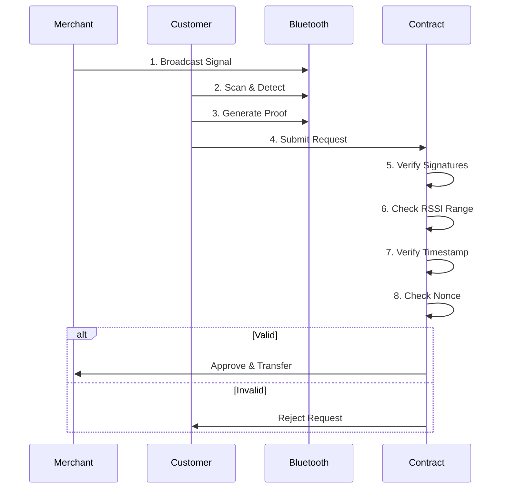

---

## 🔬 Additional Innovation: Bluetooth Proximity Verification

> **Note**: This Bluetooth protocol is **NOT part of this grant proposal**. It's a separate innovation we built at the Solana Hackathon that complements Humanity's identity layer. We mention it here to show our comprehensive anti-fraud approach.

### The Problem: Remote Bot Farms

Even with perfect identity verification (Humanity palm scan), a bot farm operator in India could:

1. Verify their identity once (real human, real palm scan)
2. Create fake merchant accounts remotely
3. Request loans to themselves from thousands of miles away
4. Drain the protocol without ever being physically present

**Humanity solves**: Who you are (proof of humanhood + uniqueness)  
**Bluetooth solves**: Where you are (proof of physical proximity)

### How Bluetooth Proximity Works

### Why Radio Physics Beats All Other Methods

| **Attack Vector**   | **Traditional KYC** | **World ID**            | **Humanity**            | **Humanity + BLE**                |
| ------------------- | ------------------- | ----------------------- | ----------------------- | --------------------------------- |
| **Fake ID**         | ❌ Easy to forge    | ✅ Iris biometric       | ✅ Palm biometric       | ✅ Palm biometric                 |
| **Identity Theft**  | ❌ Common           | ⚠️ Possible (deep fake) | ⚠️ Possible (deep fake) | ✅ Requires physical presence     |
| **Remote Bot Farm** | ❌ Trivial          | ❌ Trivial              | ❌ Trivial              | ✅ **Impossible**                 |
| **GPS Spoofing**    | ❌ Trivial          | ❌ Not used             | ❌ Not used             | ✅ Radio physics can't be spoofed |
| **Relay Attack**    | N/A                 | N/A                     | N/A                     | ✅ Detected via latency checks    |

**Key Insight**: A bot farm operator in India **cannot pretend** their phone is standing next to a merchant in Manila. Radio wave physics makes it impossible to fake RSSI remotely.

### How Humanity + BLE Could Work Together (Future)

**Phase 1 (This Grant)**: Humanity Protocol only

- Proves user is unique human via palm scan
- Sufficient for micro-pilot validation

**Phase 2 (Future)**: Humanity + Bluetooth

- Humanity: Proves user is unique human
- Bluetooth: Proves user is physically next to merchant
- Combined: Impossible to attack remotely
