# Building Fraud-Proof DeFi: How We Used Bluetooth Proximity Verification on Solana

*What I built at the Solana Cypherpunk Hackathon in Berlin*

---

## The Problem: Bot Farms Are Killing DeFi Lending

Here's a uncomfortable truth about DeFi lending: **One operator with 1,000 fake accounts can drain an entire protocol in under an hour.**

While working on nano-loans for the 2.5 billion unbanked people globally, I hit this wall repeatedly. Traditional identity verification methods don't work at this scale:

- **GPS?** Easily spoofed
- **QR codes?** Screenshot and shared
- **Video calls?** Deepfaked
- **Manual KYC?** Costs \$50+ per user (impossible for \$2 loans)

The question became: **How do you prove two people are physically standing next to each other, on-chain, without expensive infrastructure?**

---

## The Solution: Bluetooth Low Energy (BLE) Proximity Verification

The answer came from physics. You can't fake radio waves remotely.

### Core Innovation: Cryptographic Proximity Proofs

Our protocol combines three elements that, when verified together on-chain, create an unforgeable proof of physical proximity:

1. **Radio Signal Strength (RSSI)** - Proves maximum 10-meter distance
2. **Ed25519 Signatures** - Both parties cryptographically sign the proof
3. **Unique Nonces** - Each proof can only be used once

```mermaid
flowchart TB
    subgraph Physical["Physical World"]
        Customer[👤 Customer Phone]
        Merchant[🏪 Merchant Phone]
        Customer -->|Bluetooth Signal| Merchant
        Merchant -->|RSSI: -62 dBm| Customer
    end
    
    subgraph Crypto["Cryptographic Layer"]
        Customer -->|Sign with Private Key| CustomerSig[Customer Signature]
        Merchant -->|Sign with Private Key| MerchantSig[Merchant Signature]
        CustomerSig --> ProofGen[Proximity Proof]
        MerchantSig --> ProofGen
        RSSI[RSSI + Timestamp + Nonce] --> ProofGen
    end
    
    subgraph Blockchain["Solana Blockchain"]
        ProofGen -->|Submit Transaction| Anchor[Anchor Program]
        Anchor -->|Verify Signatures| Check1{Valid?}
        Anchor -->|Check RSSI Range| Check2{< 10m?}
        Anchor -->|Check Timestamp| Check3{Fresh?}
        Anchor -->|Check Nonce| Check4{Unique?}
        Check1 --> Approved[✅ Loan Approved]
        Check2 --> Approved
        Check3 --> Approved
        Check4 --> Approved
    end
    
    style Physical fill:#9945FF,stroke:#9945FF,color:#FFFFFF
    style Crypto fill:#14F195,stroke:#14F195,color:#121212
    style Blockchain fill:#00D4AA,stroke:#00D4AA,color:#FFFFFF
```



---

## The Protocol in Action

Let me walk you through a real transaction flow from our demo:

### Step 1: Merchant Starts Broadcasting

The merchant opens the app and starts broadcasting their presence via Bluetooth.


### Step 2: Customer Detects Merchant

The customer walks up and their phone detects the merchant's Bluetooth signal. The app shows:
- Merchant name
- Signal strength (RSSI): -62 dBm
- Estimated distance: ~5 meters


### Step 3: Customer Requests Loan

The customer requests a \$2 nano-loan. Both phones now:
1. Generate Ed25519 signatures using their private keys
2. Include the RSSI measurement (-62 dBm)
3. Add a timestamp (proves freshness)
4. Include a unique nonce (prevents replay attacks)


### Step 4: On-Chain Verification

The proximity proof gets submitted to our Solana Anchor program, which performs four critical checks:

```rust
pub fn verify_proximity(ctx: Context<VerifyProximity>) -> Result<()> {
    let proof = &ctx.accounts.proximity_proof;
    
    // 1. Verify Ed25519 signatures from both parties
    require!(
        verify_signature(&proof.customer_signature, proof.customer),
        ErrorCode::InvalidCustomerSignature
    );
    require!(
        verify_signature(&proof.merchant_signature, proof.merchant),
        ErrorCode::InvalidMerchantSignature
    );
    
    // 2. Check RSSI is within valid range (-30 to -90 dBm = max 10m)
    require!(
        proof.rssi >= -90 && proof.rssi <= -30,
        ErrorCode::InvalidProximity
    );
    
    // 3. Verify timestamp is fresh (< 5 minutes old)
    let current_time = Clock::get()?.unix_timestamp;
    require!(
        current_time - proof.timestamp < 300,
        ErrorCode::ProofExpired
    );
    
    // 4. Ensure nonce hasn't been used before (prevents replay)
    require!(
        !proof.nonce_used,
        ErrorCode::NonceAlreadyUsed
    );
    
    // Mark proof as verified
    proof.verified = true;
    
    Ok(())
}
```

### Step 5: Merchant Approves

The merchant sees the loan request with verified proximity proof and can approve it instantly.


**Total time: 5 seconds.**

---

## Why Bot Farms Can't Fake This

### The Physics Problem

Bot farm operators have a fundamental problem: **they can't be in two places at once.**

A typical bot farm attack would require:
- Device A near the real merchant (physical location)
- Device B near the fake customer (remote location)
- Relay the Bluetooth signals between them

But here's where physics defeats them:

#### Defense Layer 1: RSSI Latency Checking

```mermaid
graph LR
    A[Direct BLE Connection] -->|1-5ms RTT| B[✅ Verified]
    C[Relayed Connection] -->|50-200ms RTT| D[❌ Rejected]
    
    style A fill:#14F195,stroke:#14F195,color:#121212
    style B fill:#14F195,stroke:#14F195,color:#121212
    style C fill:#FF6B6B,stroke:#FF6B6B,color:#FFFFFF
    style D fill:#FF6B6B,stroke:#FF6B6B,color:#FFFFFF
```



Direct Bluetooth: **1-5 milliseconds** round-trip time  
Relay attack: **50-200 milliseconds** (impossible to hide)

#### Defense Layer 2: Challenge-Response Protocol

The protocol sends a random challenge that must be signed within 100ms. A relay simply can't meet this timing requirement.

#### Defense Layer 3: Signal Pattern Analysis

Real Bluetooth has natural RSSI fluctuation (±3-5 dBm) due to:
- Hand movement
- Body orientation
- Environmental interference

Relayed signals are too stable - they get flagged immediately.

---

## The Technical Stack

### Smart Contract: Solana + Anchor

```
├── Anchor Framework v0.29
├── Solana Chain ID: 480 (World Chain) / Mainnet
├── Ed25519 signature verification
├── Program Derived Accounts (PDAs) for loans
└── Real-time state updates
```

Key program accounts:
- `ProximityProof` - Stores RSSI, signatures, nonce
- `LoanAccount` - Tracks loan state and repayment
- `MerchantAccount` - Merchant limits and statistics

### Frontend: Next.js + WebSocket Demo

For the hackathon, I built a web-based demo using WebSockets to simulate BLE:

```typescript
// Simulated BLE broadcast (real version uses react-native-ble-plx)
socket.emit('merchant:broadcast', {
  merchantId: publicKey.toString(),
  merchantName: "Alex's Sari-Sari Store",
  timestamp: Date.now()
});

// Simulated proximity detection with RSSI
socket.on('merchant:detected', (data) => {
  const rssi = -45 - Math.floor(Math.random() * 30); // -45 to -75 dBm
  const distance = calculateDistance(rssi);
  
  setDetectedMerchants(prev => [...prev, {
    ...data,
    rssi,
    distance: `~\${distance}m`
  }]);
});
```


---

## Real-World Impact: Already Proven

This isn't just a hackathon project. We've been running a live version on World Chain mainnet with real merchants in the Philippines:

- **85% repayment rate** (vs 60-70% industry average)
- **Real merchants** serving their communities
- **\$0.25 - \$25** loan sizes
- **5-second** approval time

The difference? **We can actually verify the borrower is standing in front of the merchant.**

---

## What's Next: Scaling on Solana

### Why We're Migrating to Solana

**1. Transaction Costs**

- World Chain: ~\$0.05 per transaction
- Solana: **\$0.002 per transaction**

For \$2 loans, this difference is critical. We can't have transaction fees eating 2.5% of the loan amount.

**2. Solana Mobile Stack**

Solana has built-in mobile infrastructure:
- React Native libraries for BLE
- Saga phone integration
- Mobile wallet support
- Built for this exact use case

### Production Roadmap


**Q1 2026**: React Native mobile app  
**Q2 2026**: 10-merchant pilot in Manila  
**Q3 2026**: Scale to 100+ merchants  
**Q4 2026**: Expand to Kenya and India  

---

## The Market Opportunity

Let's talk numbers:

- **2.5 billion** people globally without bank accounts
- **\$380 billion** nano-lending market size
- **215 million** people in our initial target markets (Philippines, Kenya, India)

But here's what matters more: **These are real people who need \$2 to buy inventory for their store, \$5 to pay for medicine, \$10 to fix their motorcycle so they can work.**

Traditional financial systems ignore them because the KYC costs (\$50+) exceed the loan size.

Bot farms drain DeFi protocols that try to serve them.

**BLE proximity verification solves both problems.**

---

## Open Questions & Community Feedback

I'd love to hear from the community on a few technical challenges:

### 1. Distance Calibration

RSSI-to-distance conversion varies by:
- Phone model (antenna strength)
- Environment (walls, interference)
- Weather (humidity affects signal)

How can we create a more robust calibration system?

### 2. Offline Transactions

What if the merchant is in an area with poor internet? Could we:
- Queue transactions locally
- Batch submit when online
- Use state channels for instant settlement?

### 3. Cross-Chain Expansion

Should proximity proofs be standardized across chains? Imagine:
- Verify once on Solana
- Use proof on Ethereum, Base, etc.
- Enable cross-chain nano-lending

---

## Key Takeaways

If you're building identity or fraud prevention in DeFi:

✅ **Physics beats software** - You can't fake radio waves remotely  
✅ **Combine proof types** - Cryptography + proximity + timing = unforgeable  
✅ **Think mobile-first** - 2.5B unbanked people have smartphones, not laptops  
✅ **Keep it simple** - 5-second verification is better than 5-minute KYC  
✅ **Test with real users** - 85% repayment proves the model works  

---

## Try It Yourself

The complete code is open source on GitHub:

**Repository**: [github.com/alexovate/solana-nanocredit](https://github.com/alexovate/solana-nanocredit)

Includes:
- Complete Anchor program with tests
- Demo web app (WebSocket simulation)
- Documentation and architecture diagrams
- Production BLE implementation roadmap

### Run the Demo Locally

```bash
# Clone the repo
git clone https://github.com/alexovate/solana-nanocredit
cd solana-nanocredit

# Start local Solana validator
solana-test-validator

# Deploy program (in another terminal)
anchor deploy

# Start demo app
cd app
npm install
npm run dev
```

Open two browser tabs - one as merchant, one as customer. Watch the proximity verification happen in real-time!

---

## Final Thoughts

The Solana Cypherpunk Hackathon in Berlin was an incredible experience. Building alongside 38 other teams, all pushing the boundaries of what's possible with blockchain, reminded me why I'm in this space.

We're not just building protocols - we're building infrastructure for financial inclusion. When 2.5 billion people are excluded from the financial system, and DeFi protocols are getting drained by bot farms, **we need better primitives.**

Bluetooth proximity verification is one primitive. What others are we missing?

I'd love to hear your thoughts, ideas, and critiques. Drop a comment or reach out directly.

---

**Building in public** 🚀  
**Competing for**: Börse Stuttgart & Mansory Tracks  
**Contact**: alex@nanocredit.world  
**GitHub**: [github.com/alexovate/solana-nanocredit](https://github.com/alexovate/solana-nanocredit)  

**Watch the full pitch**: [Solana Cypherpunk Hackathon Demo Day](https://www.youtube.com/live/3eyuLtut9sk?t=11060)

---

*Special thanks to Carlo Abdel-Nour and the entire Solana Superteam Germany team for organizing this hackathon, and to Staking Facilities GmbH & Arcium for their support.*

#Solana #DeFi #Blockchain #FinancialInclusion #BLE #CryptoForGood #BuildInPublic

