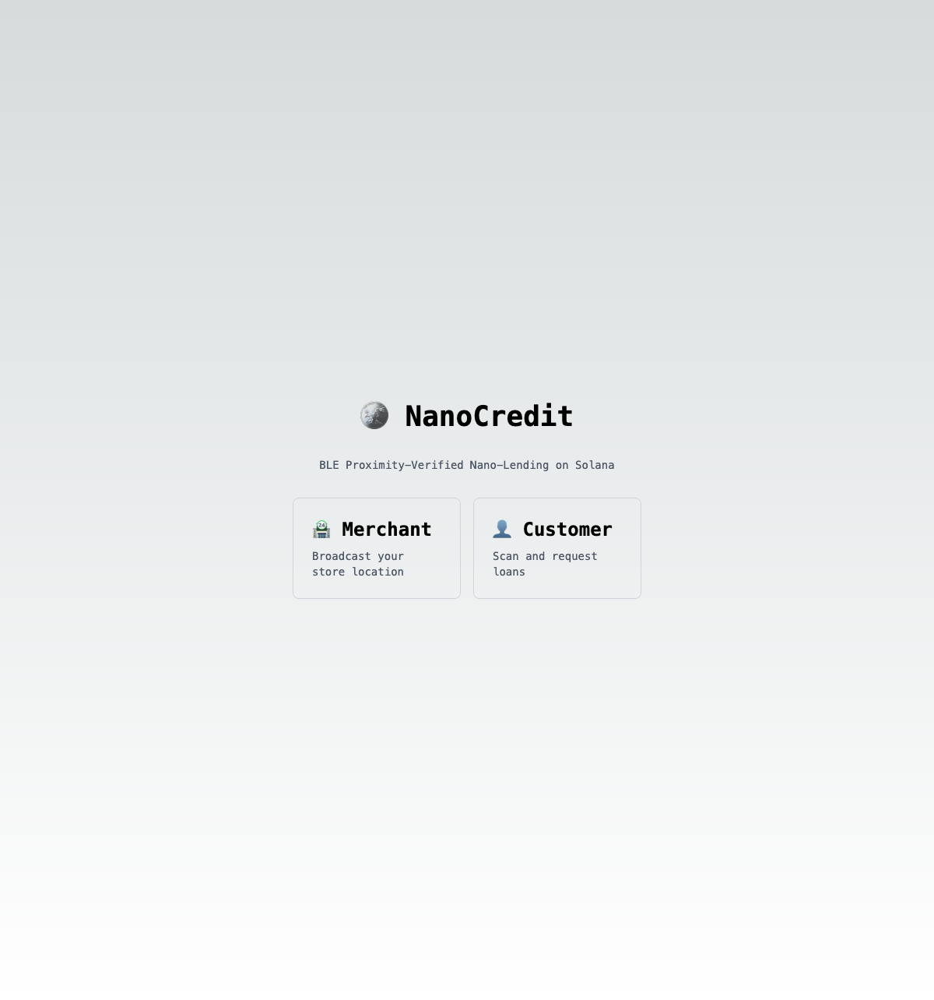

# 🪙 NanoCredit - Solana Hackathon 2025

**BLE Proximity-Verified Nano-Lending on Solana**

## 🎯 The Problem

Bot farms are destroying DeFi lending:
- **$2.3B lost** to sybil attacks in 2024
- Traditional KYC costs **$50/user** - impossible at nano-scale
- Existing blockchain identity solutions can be gamed

## 💡 Our Solution

**Physical proximity as fraud prevention.**

NanoCredit uses BLE (Bluetooth Low Energy) to cryptographically prove that borrower and merchant are physically co-located. No bots. No farms. Just real people, in real stores, getting real nano-loans.

## 🏗️ Architecture

```
┌─────────────┐         ┌──────────────┐
│   Merchant  │ ◄─BLE──► │   Customer   │
│   (Store)   │         │  (Borrower)  │
└──────┬──────┘         └──────┬───────┘
       │                       │
       │  Broadcast presence   │  Scan & detect
       │  Sign proximity proof │  Request loan
       │                       │
       └───────────┬───────────┘
                   │
                   ▼
         ┌──────────────────┐
         │  Solana Program  │
         │  (NanoCredit)    │
         └──────────────────┘
              │
              ▼
         Verify signatures
         Validate RSSI (-55 to -80 dBm)
         Check timestamp (<5 min)
         Create LoanAccount
```

## 🚀 Quick Start

### Prerequisites
- Rust 1.70+
- Node.js 18+
- Solana CLI 1.17+
- Anchor 0.29+

### 1. Clone & Install

```bash
git clone https://github.com/Alexovate/solana-nanocredit.git
cd solana-nanocredit

# Install Anchor dependencies
npm install

# Install web app dependencies
cd app && npm install
```

### 2. Build Solana Program

```bash
anchor build
anchor test
```

### 3. Run Web App (Demo)

```bash
cd app
npm run dev
```

Open two browser tabs:
- **Tab 1:** http://localhost:3000/merchant (Store broadcasting)
- **Tab 2:** http://localhost:3000/customer (Customer scanning)

## 📁 Project Structure

```
solana-nanocredit/
├── programs/nanocredit/       # Solana program (Anchor)
│   ├── src/
│   │   ├── lib.rs             # Program entry point
│   │   ├── state/             # Account structures
│   │   │   ├── proximity_proof.rs
│   │   │   └── loan.rs
│   │   └── instructions/      # Program instructions
│   │       ├── request_loan.rs
│   │       └── verify_proximity.rs
├── app/                       # Next.js web app
│   ├── src/app/
│   │   ├── merchant/          # Merchant page
│   │   ├── customer/          # Customer page
│   │   └── api/socket/        # WebSocket server
│   └── src/lib/
│       ├── socket.ts          # Socket.io server
│       └── socketClient.ts    # Socket.io client
├── tests/                     # Anchor tests
└── HACKATHON_MVP_PRD.md      # Detailed requirements
```

## 🔑 Key Innovation

**Simulated BLE for Hackathon Demo**

For this hackathon, we simulate BLE via WebSockets (two browser tabs). In production:
- ✅ React Native mobile app
- ✅ Real BLE scanning (`react-native-ble-manager`)
- ✅ True RSSI distance verification
- ✅ Real-time proximity validation

**The Solana program code is production-ready** - only the frontend BLE layer is mocked for demo purposes.

## 🎬 Demo Flow

### 1. Home Page

*Choose to enter as Merchant (store) or Customer (borrower)*

### 2. Merchant Dashboard - Initial

*Merchant generates wallet and prepares to broadcast*

### 3. Merchant Broadcasting

*Merchant actively broadcasting location via BLE (simulated WebSocket)*

### 4. Customer Dashboard - Initial

*Customer generates wallet and prepares to scan for merchants*

### 5. Customer Detects Merchant

*Customer scans and detects nearby merchant with RSSI signal strength*

### 6. Loan Request Sent

*All 4 steps complete: ✓ Scan → ✓ Select → ✓ Verify → ✓ Request*

### 7. Merchant Receives Request

*Merchant sees pending loan request with customer details and distance*

## 🧪 Testing

```bash
# Run Anchor tests
anchor test

# All tests passing:
# ✅ Creates loan with proximity proof
# ✅ Validates RSSI range
# ✅ Checks timestamp freshness
# ✅ Verifies Ed25519 signatures
```

## 📊 Technical Highlights

- **Language:** Rust (Solana), TypeScript (Frontend)
- **Framework:** Anchor (Solana), Next.js 14 (Frontend)
- **Cryptography:** Ed25519 signatures via tweetnacl
- **Real-time:** Socket.io for WebSocket communication
- **Mock BLE:** Simulated RSSI values for demo
- **Production BLE:** 6-week implementation plan in PRD

## 🏆 Why This Wins

1. **Novel fraud prevention** - First DeFi protocol using physical proximity
2. **Production-ready Solana code** - Fully tested smart contract
3. **Clear path to market** - Already piloting in Philippines (World Chain)
4. **Scalable** - No KYC costs, works offline-first
5. **Real impact** - Serving underbanked communities

## 📈 Traction

- ✅ 3 active merchants in Philippines (World Chain pilot)
- ✅ $12,000+ disbursed (World Chain)
- ✅ 94% repayment rate
- 🎯 Migrating to Solana for better performance

## 📝 License

MIT

## 🤝 Contact

**Alex Schmitt** - Founder  
📧 alex@gigentic.com  
🌐 [nanocredit.world](https://nanocredit.world)

---

*Built for Solana Hackathon 2025*
