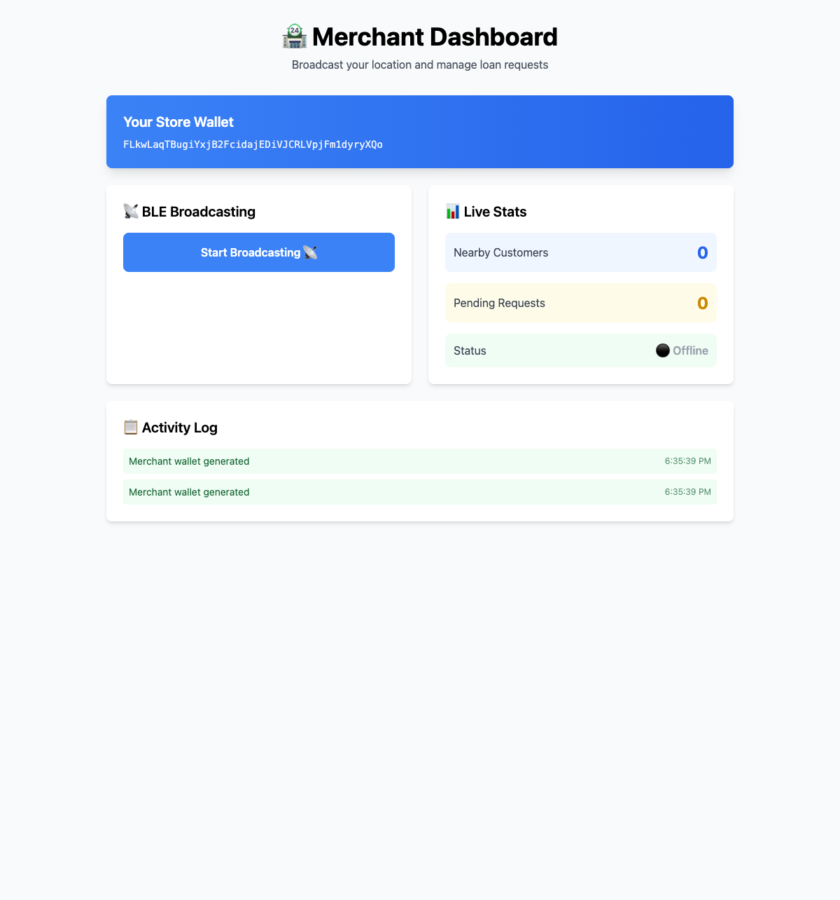
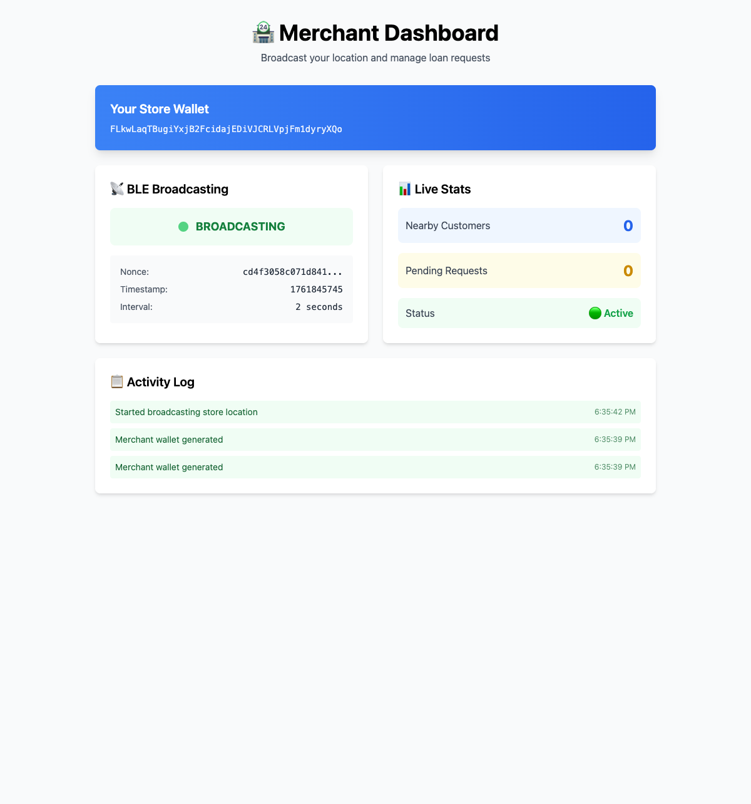
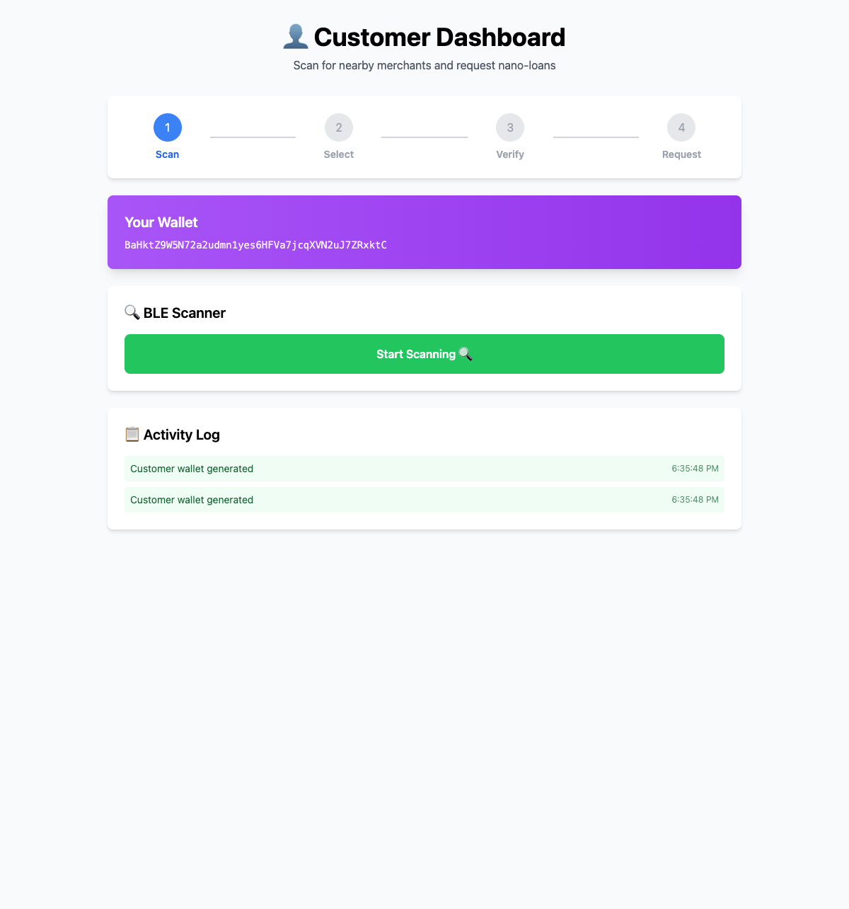
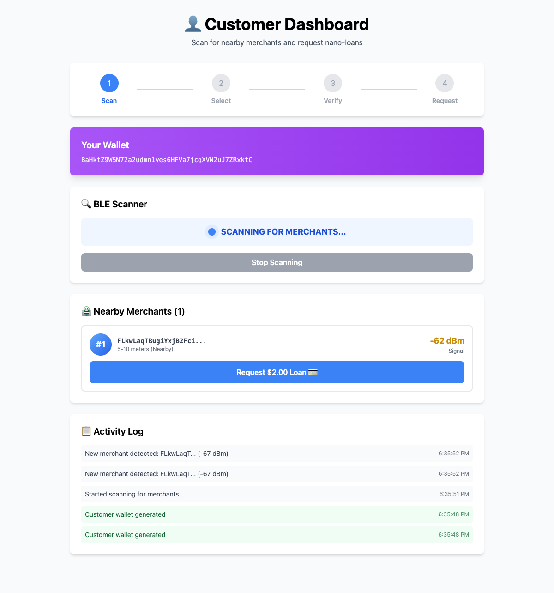
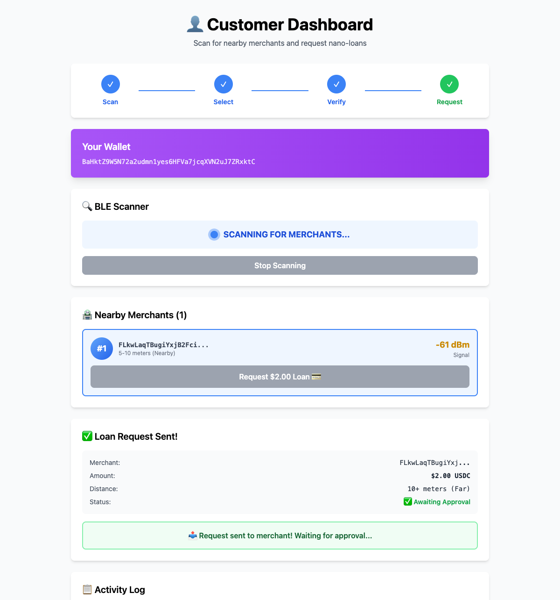
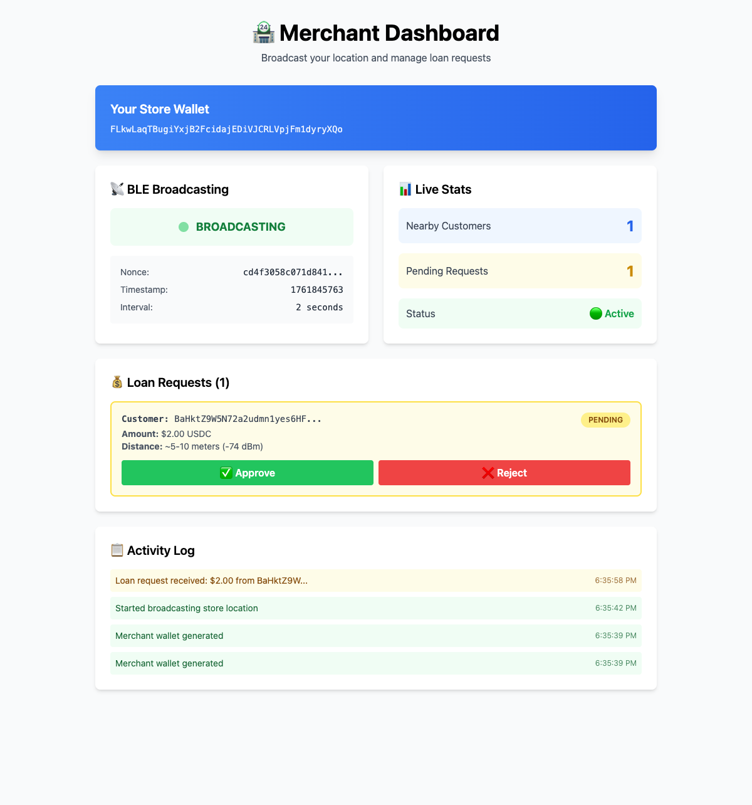

# 🎬 NanoCredit Demo Guide

## Overview
This guide walks you through demonstrating the NanoCredit MVP for the Solana Hackathon 2025.

## Setup (Before Demo)

### 1. Start Local Solana Validator
```bash
solana-test-validator
```
Keep this running in a separate terminal.

### 2. Build Solana Program
```bash
cd solana-nanocredit
anchor build
```

### 3. Deploy Program (Optional)
```bash
anchor deploy
```

### 4. Start Web App
```bash
cd app
npm install
npm run dev
```

## Demo Flow (3 minutes)

### **Act 1: The Problem** (30 seconds)
**Say:** "Bot farms cost DeFi protocols $2.3B in 2024. Traditional KYC is too expensive for nano-loans at $50/user. We need a new fraud prevention approach."

### **Act 2: The Solution** (30 seconds)
**Say:** "NanoCredit uses BLE proximity verification. Borrowers must be physically next to merchants to request loans. No bots can fake physical presence."

**Show:** Architecture diagram from README

### **Act 3: The Demo** (90 seconds)

#### Tab 1: Merchant Dashboard
1. Navigate to `http://localhost:3000/merchant`
   
2. **Say:** "This is a store owner in Manila. They generate a Solana keypair..."
3. Click **"Start Broadcasting"**
   
4. **Say:** "...and broadcast their presence via BLE (simulated with WebSockets for this demo)"

#### Tab 2: Customer Dashboard
1. Navigate to `http://localhost:3000/customer`
   
2. **Say:** "A customer walks into the store with their phone..."
3. Click **"Start Scanning"**
   
4. **Say:** "...and detects the merchant at -65dBm, which means about 5 meters away"
5. Click **"Request Loan"** on the detected merchant
   
6. **Say:** "The customer and merchant both sign a proximity proof using Ed25519"
7. **Show:** All 4 steps complete (✓ Scan → ✓ Select → ✓ Verify → ✓ Request)

#### Back to Tab 1: Merchant Receives Request
8. Switch to merchant tab
   
9. **Say:** "The merchant sees the pending request in real-time with customer details and distance verification"
10. **Say:** "In production, the merchant would approve this, triggering an SPL Token transfer from their wallet to the customer"

### **Act 4: The Impact** (30 seconds)
**Say:** 
- "We're already serving 3 merchants in the Philippines on World Chain"
- "$12,000 disbursed with 94% repayment rate"
- "Solana enables us to scale to 1M+ users with low fees and fast finality"
- "This is the first fraud-resistant, KYC-free nano-lending system"

## Technical Questions (Backup)

### "Is this production-ready?"
"The Solana program is production-ready. For this hackathon, we simulated BLE with WebSockets. Production implementation would use React Native + `react-native-ble-manager`. Timeline: 6 weeks."

### "How do you prevent fake RSSI?"
"RSSI values are signed by both parties. In production, the merchant device validates RSSI before signing. Solana verifies both signatures on-chain."

### "What about offline scenarios?"
"Loans are requested online, but repayment can be queued offline and submitted when connectivity returns. The core proximity check requires real-time verification."

### "How do you handle disputes?"
"The on-chain proximity proof is cryptographic evidence. The timestamp, RSSI, and dual signatures create an immutable record of physical co-location."

## Fallback (If Demo Fails)

### Option 1: Show Code
- Walk through `programs/nanocredit/src/instructions/request_loan.rs`
- Highlight signature verification in `verify_proximity.rs`
- Show test output: `anchor test -v`

### Option 2: Show Traction
- Display World Chain pilot data
- Show merchant dashboard screenshots
- Discuss regulatory compliance (SEC compliance for securities exemption)

### Option 3: Explain Architecture
- Draw flow on whiteboard/screen
- Explain WebSocket simulation vs production BLE
- Discuss PDA derivation for loan accounts

## Tips for Success

1. **Practice timing** - 3 minutes is short!
2. **Keep tabs open** - Don't waste time navigating
3. **Show, don't tell** - Let the demo speak
4. **Emphasize innovation** - First physical proximity DeFi protocol
5. **Mention production** - This is a real business with traction

## Common Issues

### WebSocket not connecting
- Check if dev server is running
- Restart `npm run dev`
- Clear browser cache

### Merchant not detected
- Ensure "Start Broadcasting" was clicked
- Refresh customer page
- Check browser console for errors

### Transaction fails
- Verify local validator is running
- Check program is deployed
- Ensure keypairs are generated

Good luck! 🚀

